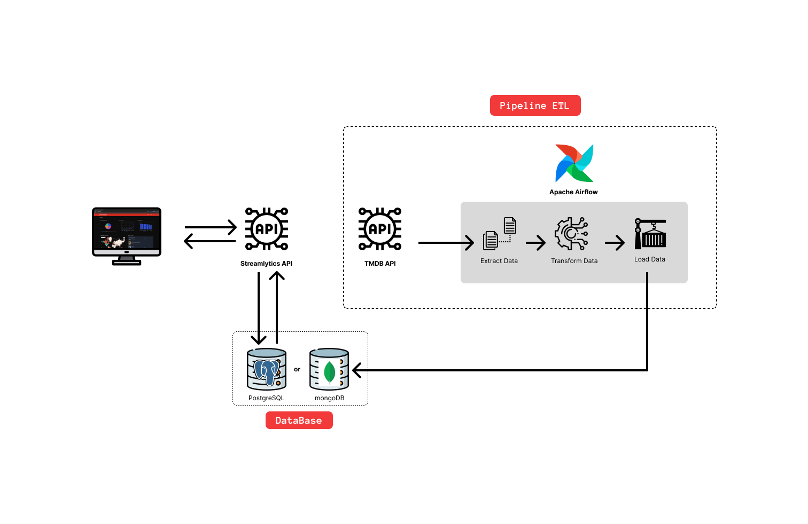
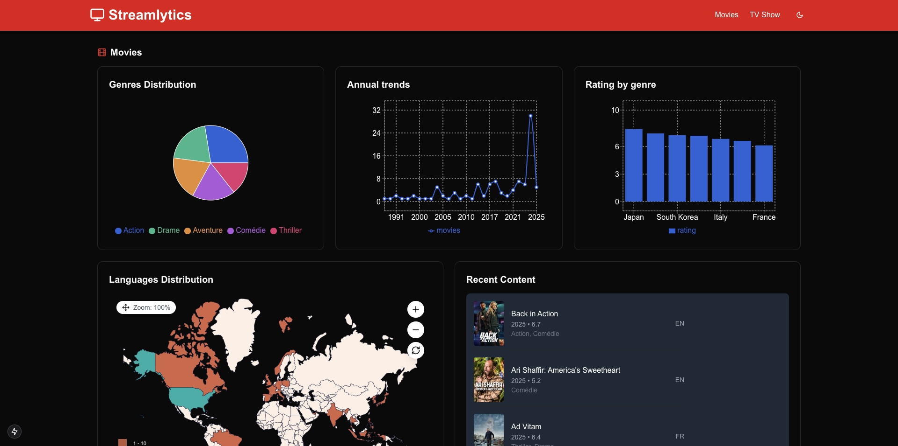

# Streamlytics

**Streamlytics** is an [ETL](https://fr.wikipedia.org/wiki/Extract-transform-load) (Extract, Transform, Load) pipeline project designed to analyze and explore the Netflix catalogue using data from the [TMDB API](https://developer.themoviedb.org/reference/intro/getting-started).  
This project aims to provide rich analytical insights into the films and series available on Netflix, such as dominant genres, average scores and production trends.

## 📖 Table of Contents

- [Streamlytics](#streamlytics)
  - [📖 Table of Contents](#-table-of-contents)
  - [🏗️ Project Architecture](#️-project-architecture)
  - [🚀 Tech Stack](#-tech-stack)
    - [Backend \& ETL](#backend--etl)
    - [Frontend](#frontend)
  - [📦 Installation](#-installation)
    - [Prerequisites](#prerequisites)
    - [Backend](#backend)
      - [Database](#database)
      - [Airflow](#airflow)
  - [💻 Usage](#-usage)
  - [📂 Project Structure](#-project-structure)
  - [📊 Demo](#-demo)
  - [](#)
  - [📜 License](#-license)
  - [📩 Contact \& Support](#-contact--support)

## 🏗️ Project Architecture



1. **ETL with Airflow**: Extracts data from the TMDB API, processes it, and stores it in PostgreSQL & MongoDB.
2. **Databases**:
   - PostgreSQL: Stores processed analytical data.
   - MongoDB: Holds raw JSON data for flexibility.
3. **FastAPI Backend**: Provides RESTful API endpoints for data access.
4. **Next.js Frontend**: Displays interactive visualizations and dashboards.
5. **Statistical Analysis**: Runs daily and stores results for performance optimization.

## 🚀 Tech Stack

### Backend & ETL

- ETL : [Apache Airflow](https://airflow.apache.org) 2.0+
- API : [FastAPI](https://fastapi.tiangolo.com)
- Databases : PostgreSQL 17.2+, MongoDB 8.0+
- Python 3.9+

### Frontend

- NextJS
- TailwindCSS
- Chart.js
- Nivo

## 📦 Installation

### Prerequisites

```bash
python >= 3.9
postgresql >= 17.2
mongodb >= 8.0
node >= 18
```

- TMDB API account (obtain an API key from [TMDB](https://developer.themoviedb.org/))

### Backend

```bash
# Clone & Install
git clone https://github.com/jass228/streamlytics.git
cd streamlytics/backend
pip install -r requirements.txt
```

#### Database

1. PostgreSQL: Create a database named `streamlytics`.
2. MongoDB: Ensure MongoDB is running.
3. Add your TMDB API key to .env:

#### Airflow

```bash
export AIRFLOW_HOME=./airflow
airflow db init
airflow users create --username admin --password admin --role Admin --email admin@example.com
airflow scheduler & airflow webserver
```

Then activate and trigger the DAG in the Airflow UI (http://localhost:8080).

## 💻 Usage

1. Run the ETL Pipeline

   - Open Airflow at http://localhost:8080
   - Activate and run the etl_tmdb_netflix DAG

2. Access Processed Data

   - PostgreSQL: Use pgAdmin to explore stored data.
   - MongoDB: Use Mongo Compass to inspect raw JSON data.

3. Start the Backend API

```bash
cd backend/api
uvicorn main:app --reload

```

- API Documentation: http://127.0.0.1:8000/docs

4. Frontend

```bash
cd frontend
npm install
npm run dev
```

- Visit: http://localhost:3000

## 📂 Project Structure

```plaintext
streamlytics/
│── backend/                      # FastAPI Backend
│   ├── airflow/                   # ETL pipeline with Apache Airflow
│   ├── api/                       # FastAPI server
│   ├── stats/                      # Data analysis
│── frontend/                      # Next.js Frontend
│── .env                            # Environment variables
│── README.md                       # Project documentation

```

## 📊 Demo

## 


## 📜 License

This project is licensed under the MIT License.

## 📩 Contact & Support

👨‍💻 Author: Joseph A.  
📌 Feel free to open an issue for questions or suggestions!
